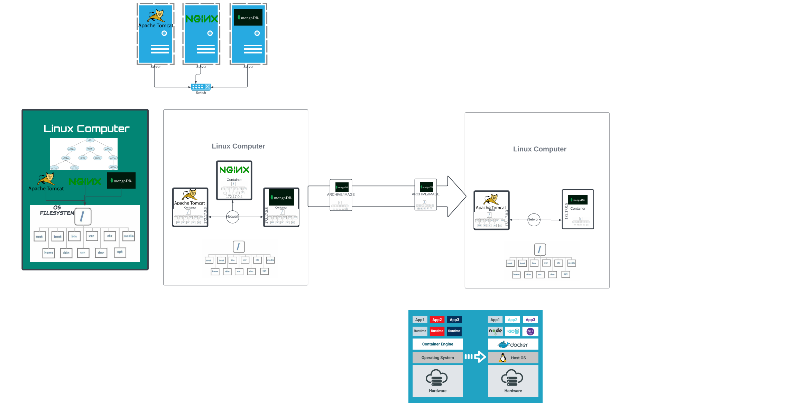
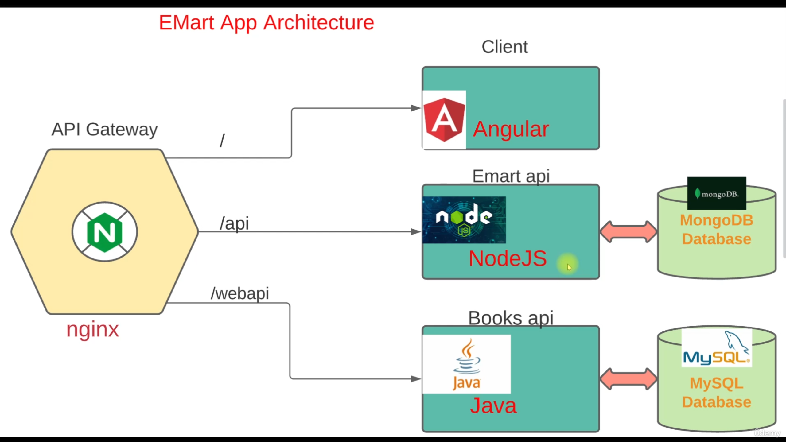
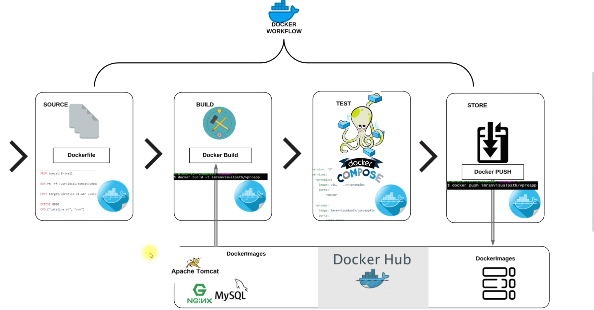

# 📦 vProfile & eMart on Docker

**Monolithic vs Microservices Containerization**

This repository contains **two containerized web application deployments** built as part of the Containers section of my DevOps learning journey:

1. **vProfile (Monolithic)** – Java web application containerized with Docker.
2. **eMart (Microservices)** – E-commerce app split into multiple services (Angular, Node.js, Java APIs, Databases) running via Docker Compose.

Both are deployed inside a **Vagrant-provisioned VM** with synced directories, following production-like practices.

---

## 📌 vProfile – Monolithic Architecture

### 1. Overview

The **vProfile project** is a Java-based **monolithic** web application deployed using Docker containers.  
In a monolithic setup, all application logic (UI + backend + integrations) is packaged into a **single artifact** and deployed as one unit.

Here, the **Tomcat** container runs the `vprofile.war` containing all services, supported by separate containers for the DB, cache, and message broker.

### Architecture Diagram



**Services in Docker Compose:**

- **Nginx** – Reverse proxy that forwards requests to Tomcat.
- **Tomcat (vprofile-app)** – Runs `vprofile.war` (full app logic).
- **MySQL** – Persistent relational database.
- **Memcached** – In-memory cache.
- **RabbitMQ** – Message broker.

**Flow:**  
`Client → Nginx → Tomcat (vProfile WAR) → MySQL / Memcached / RabbitMQ`

### 3. Key Learnings

**Monolithic drawbacks:**

- Single artifact → Any change requires redeploying the whole app.
- Scaling individual components is hard.

**Containers:**

- Lightweight, isolated environments.
- Built from images (prebuilt from Docker Hub or locally built).

**Docker Compose:**

- Defines multi-container setup in a single file.
- Handles networking (service name resolution).

**Vagrant Synced Directory:**

- `config.vm.synced_folder "../compose", "/vagrant_data"`
- Allows editing on host and running inside the VM.

### 4. Setup & Run

```bash
# Start VM
vagrant up

# SSH into VM
vagrant ssh

# Go to synced folder
cd /vagrant_data

# Start containers in detached mode
docker compose up -d

# Verify running containers
docker ps

# Access in browser
http://<VM-IP>
```

### 5. Cleanup

```bash
docker compose down
docker system prune -a
vagrant halt
```

## 📌 eMart – Microservices Architecture

### 1. Overview

The **eMart project** is an e-commerce style application designed using **microservices architecture**.  
Instead of one artifact, the app is split into **independent services** (Angular UI, Node.js API, Java API, Databases) that communicate via an **Nginx API Gateway**.

---

### 2. Architecture

**Services in Docker Compose:**

- **Nginx** – API Gateway & reverse proxy.
- **Client** – Angular frontend.
- **API** – Node.js backend for products & users (uses MongoDB).
- **WebAPI** – Java backend for books (uses MySQL).
- **MongoDB** – NoSQL DB for product/user data.
- **MySQL** – Relational DB for books.

**Flow:**  
`Browser → Nginx → Client / API / WebAPI → Databases`

### Architecture Diagram



---

### 3. Key Learnings

**Microservices advantages:**

- Independent deployment & scaling per service.
- Can use different tech stacks (Angular, Node.js, Java, etc.).

**Dockerfile + Compose:**

- **Dockerfile** → Defines how to build images (for services not on Docker Hub).
- **docker-compose.yml** → Orchestrates all services, builds local images if needed.

**Networking:**

- Internal Docker network, services talk via names.
- Port mapping exposes specific services to the host.

**Vagrant Synced Directory:**

- `config.vm.synced_folder "../emart", "/vagrant_data"`

---

### 4. Setup & Run

```bash
# Start VM
vagrant up

# SSH into VM
vagrant ssh

# Go to synced folder
cd /vagrant_data

# Build & start containers
docker compose up -d

# Verify running containers
docker ps

# Access application
http://<VM-IP>
```

### 5. Cleanup

```bash
docker compose down
docker system prune -a
vagrant halt
```

## 🔍 Monolithic vs Microservices in This Project

| Feature                 | vProfile (Monolithic)       | eMart (Microservices)              |
| ----------------------- | --------------------------- | ---------------------------------- |
| **Deployment Unit**     | Single WAR file             | Multiple services                  |
| **Tech Stack**          | Java (Tomcat)               | Angular, Node.js, Java             |
| **Scaling**             | Entire app only             | Per service                        |
| **Images Source**       | All from Docker Hub         | Some built via Dockerfile          |
| **Communication**       | Direct service calls        | API Gateway (Nginx)                |
| **Docker Compose Role** | Orchestrates all containers | Orchestrates + builds local images |

---

## 💡 Skills Demonstrated

- Docker containerization of monolithic & microservices applications
- Writing & modifying Docker Compose files
- Building custom images using Dockerfiles
- Running containerized apps inside Vagrant VMs
- Managing multi-container networking & service discovery
- Using Nginx as reverse proxy and API Gateway
- Working with MySQL, MongoDB, RabbitMQ, and Memcached in containers

---

# 🧠 Additional Concepts & Learnings

## 🧱 Docker Fundamentals

- Understood Docker architecture: **CLI → Daemon → Containers → Registry**.
- Learned core commands for images, containers, logs, and cleanup.
- Practiced **Docker volumes** and **bind mounts** for persistent data.

---

## 🧩 Dockerfile Best Practices

- Created **multi-stage Dockerfiles** to separate build & runtime layers.
- Used `RUN`, `COPY`, `ADD`, `EXPOSE`, and `WORKDIR` instructions effectively.
- Learned about **CMD**, **ENTRYPOINT**, and combined **CMD + ENTRYPOINT (CMDENTRY)** usage for flexible container startup behavior.
- Implemented **image optimization** by combining multiple RUN statements and using `.dockerignore`.

---

## ⚙️ Docker Compose Orchestration

- Built **multi-container environments** using Compose (YAML-based).
- Learned service dependencies (`depends_on`), port mappings, environment variables, and networks.
- Created **named volumes** for data persistence.

---

## 🧰 Docker Hub & Registry Workflow

- Built → Tested → Tagged → Pushed custom images to **Docker Hub**.
- Implemented a full Docker workflow pipeline from Dockerfile creation to deployment.

---

## ☁️ Deployment Environments

- Ran containerized apps both **locally (Vagrant VM)** and on **AWS EC2 instances**.
- Automated Docker installation via **user data scripts** for cloud setups.

---

## 🧭 Docker Workflow Diagram



---

## 🧰 Tools & Technologies Used

| **Category**               | **Tools**                            |
| -------------------------- | ------------------------------------ |
| **Containerization**       | Docker, Docker Compose               |
| **Web Servers**            | Nginx, Tomcat                        |
| **Languages / Frameworks** | Java (Spring Boot), Node.js, Angular |
| **Databases**              | MySQL, MongoDB, Memcached, RabbitMQ  |
| **Build Tools**            | Maven, npm                           |
| **Dev Environment**        | Vagrant, AWS EC2, Ubuntu             |
| **Registry**               | Docker Hub                           |

---

## 🧩 Final Skill Demonstration

This repository showcases **end-to-end DevOps readiness** through two containerization approaches — **monolithic and microservices** — demonstrating not only Docker usage but complete infrastructure thinking.

---

## 🚀 What I Achieved

- Containerized full-stack applications from scratch using **Dockerfiles** and **Docker Compose**.
- Understood **multi-stage build optimization** for Java, Node.js, and Angular projects.
- Designed **production-ready architectures** with reverse proxy, caching, and message queuing.
- Automated environment provisioning using **Vagrant** and **AWS EC2 instances**.
- Implemented **registry workflow** by pushing and managing images on **Docker Hub**.
- Validated **full service communication** across containers (DB ↔ API ↔ Web layers).

---

## 🔧 DevOps Mindset Built

| **Skill Area**           | **Description**                                                         |
| ------------------------ | ----------------------------------------------------------------------- |
| **Containerization**     | Translating application setups into lightweight, portable containers.   |
| **Orchestration**        | Managing multi-container apps with Docker Compose networks and volumes. |
| **Scalability Thinking** | Transitioning from monolithic → microservice scaling strategies.        |
| **Automation**           | Using shell scripts, Vagrantfiles, and user data for consistent setups. |
| **Cloud Readiness**      | Deploying, testing, and maintaining containerized stacks on EC2.        |

---

## 🧭 Next Step → Kubernetes Orchestration

This repository lays the groundwork for the next phase:  
**Kubernetes orchestration** of containerized microservices — automating deployment, scaling, and management across clusters.
